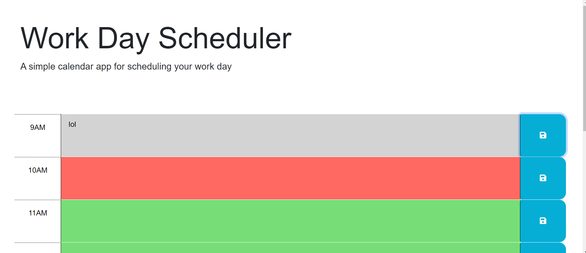

# Work Day Scheduler

## Description

A simple calendar application that allows a user to save events for each hour of a typical working day (9am–5pm).

## Table of Contents

- Installation
- Built With
- Usage
- Contributing
- License

## Installation

To install the Work Day Scheduler, simply download the files and open the index.html file in your browser.

## Built With

- HTML
- CSS
- JavaScript
- jQuery
- Day.js

## Usage

This application is designed to help users plan their workday by scheduling tasks for each hour.

## Contributing

Made by Gabby. This project utilizes insights and text generated by ChatGPT, a language model developed by OpenAI. For more information about ChatGPT, please visit [OpenAI's website](https://www.openai.com/).

## Website

[Link to the Work Day Scheduler](https://gemperador.github.io/WorkDayScheduler5/)

## Screenshot

